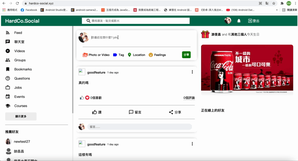

# Mern-socialApp-Vps

- Create a social website using React.js as a front end  and  Express+MongDB+Node as back end and databse 
- Deploy the project to hostinger VPS server

## Supported Web browser
- [x] Google chrome
- [x] Microsoft Edge
- [x] Firefox
- [x] Safari 

## User story 
- User can share their daily life by uploading a post  which can include text and pic .
- User can search their friends on the website and add them to see there post on their profile page
- User can chat with their friends real-time 
- User can modify their profile to show there interest and posts on their profile page

## Try it your self
- WebsiteLink https://hardco-social.xyz/
- ApiTest https://api.hardco-social.xyz/swagger

## Preivew (There are so many feature so I'm just gonna preview some of them)
### Post feature

### Notice feature

## Develop environment
- Node v16.3.0 

## Important feature
- JWT Token for security and auth
- Socket.io for sending message real-time
- Swagger API blueprint for developer
